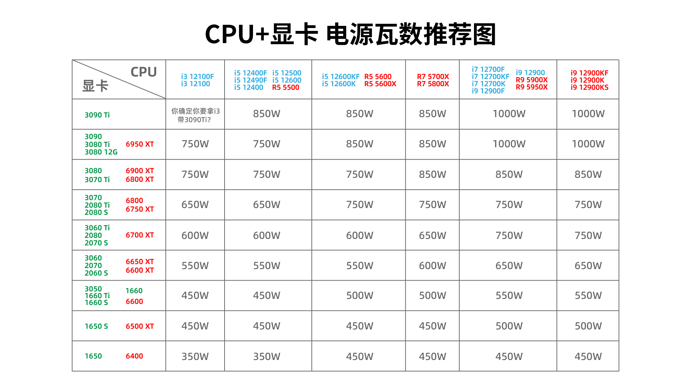
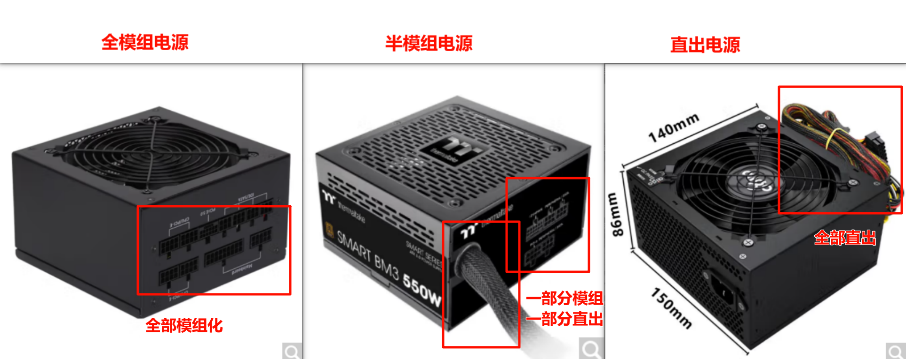

> [百度百科](https://baike.baidu.com/item/%E7%94%B5%E8%84%91%E7%94%B5%E6%BA%90/1152749)
> 
> 电脑电源的作用是将家用220V交流电变换为电脑所需的低压直流电，通过导线供给机箱内的各种用电设备。

简单来说，电源就是让你的电脑能开机的东西，大概是这样的：

## 额定功率

> 选购功率过小的电源，电脑可能在高负载时断电；选购功率过大的电源，则是对钱包的极大浪费。

衡量电源供电能力的数值被称为额定功率。额定功率，即电源在稳态下所有接口能持续稳定输出的最大功率的和。

电源实际输出功率会随着用电器需求不断调整，并不是说额定1000W的电源开机就一直是1000W。故选购大功率电源不会增加实际功耗。

实际使用中可以短暂超过额定功率运行，但此状态不稳定。

## 80PLUS 认证

**转换效率**是电源的输出功率与输入功率的比值，即

$$

电源转换效率=\frac{电源为主机提供的即时输出功率}{输入电源的即时功率}

$$

对应 80PLUS 认证，认证类型越好，转换效率越高。电源也就越省电

| 认证类型 |          白牌 < 铜牌 < 银牌 < 金牌 < 白金牌 < 钛金牌          |
| :--: | :---------------------------------------------: |
| 对应图标 |  |

由于该计划本身的局限性和监管不严，选购电源时不应过度迷信 80PLUS 认证。**一般选购金牌电源即可**

- 80PLUS 的优势和局限性：

| 优势                     | 局限性                           |
| ---------------------- | ----------------------------- |
| 1. 转换率可能影响电源的稳定性和禁音表现。 | 1.认证只能代表电源转化率水平，不能全面体现电源用料和水准 |
| 2. 认证能在一定程度上反应电源用料和质量  | 2. 80PLUS监管不严，时常出现假冒伪劣事件      |

## 直出和模组

| 全模组电源               | 半模组电源                                     | 直出电源               |
| ------------------- | ----------------------------------------- | ------------------ |
| 所有线材均可自由插拔，想用几根就插几根 | 直出和全模组的结合体。一般主板24pin供电线、cpu供电线从电源直出；其他模组化 | 所有线材直接从电源内部出来，不能改动 |
> [!note] 电源注意事项：
>
> | 显卡供电 | 模组线使用 |
> | --- | --- |
> | 有的显卡为双8pin/三8pin供电，一般推荐有几个8pin就用几根线，不要用一分二。一份二对线材压力比较大| 模组电源请务必使用自带的模组线，切记不可混用其他品牌/其他型号的模组线！！！ |

## 电源铭牌

以长城G5为例：

购买建议：

- 注意查看铭牌上的额定输出功率，防止被欺诈
- 尽量选购宽幅电源
- 尽量选购+12V输出达到电源额定功率90%以上的电源
- 尽量选择单路12V输出的电源

## 电源架构

| 选项  |     PFC      |   拓扑结构    |    整流     |  稳压结构  | 电容  |
| :-: | :----------: | :-------: | :-------: | :----: | :-: |
| 高端  |    主动式PFC    | 全桥LLC谐振拓扑 |   同步整流    | DC-DC  | 日系  |
|  ↓  |              | 半桥LLC振谐拓扑 |           |  双磁放大  | 台系  |
| 低端  |    被动式PFC    |  双管正激拓扑   |   肖特基整流   |  单磁放大  | 大陆系 |
| 备注  | 被动式PFC大多已被淘汰 |  一分钱一分货   | 同步整流已成为主流 | 一分钱一分货 |     |
## 电源选购

1. **上网搜索硬件功耗**

在搜索引擎搜索目标 CPU/显卡的评测，可获得最大功耗。

2. **各功耗相加求和**

主机的耗电大头一般是 CPU 和 显卡，其他部件功耗一般总共不足50W。

因此选购电源时主要看的就是这两个部件的功耗。一般将 CPU 与显卡最大功耗之和计算整机最大功耗。

3. **额外留出一定余量**

长期高负载运行的缺点：

- 减少电源使用寿命
- 噪音大，影响使用体验
- 高负载状态下电源出现啸叫
- 电源超过额定功率后不稳定

因此，一般在选择电源时也要留出100W~200W左右的余量。

**也可根据电源功率推荐表选购**：

## 【天才赵德柱】的电源选购一站式攻略

[CPU+显卡 电源瓦数推荐图](https://www.kdocs.cn/l/ccm3lVaKqpGZ)

[电源各瓦数品牌型号推荐表](https://www.kdocs.cn/l/cexFMHkfEeBB)

